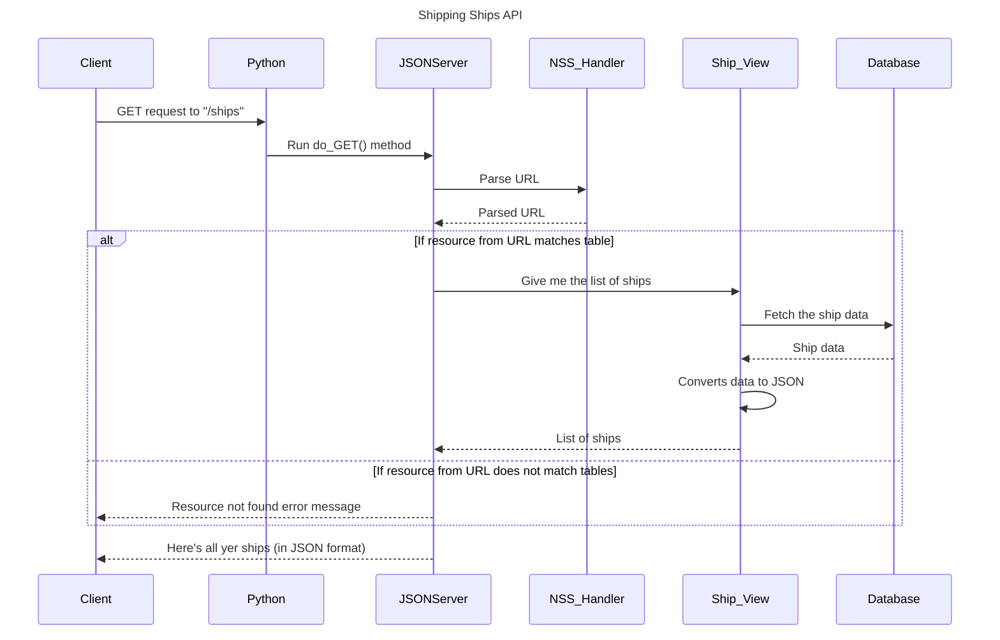

```mermaid
sequenceDiagram
    title Shipping Ships API

    participant C as Client 
    participant P as Python 
    participant J as JSONServer
    participant N as NSS_Handler 
    participant S as Ship_View
    participant D as Database

    C->>P:GET request to "/ships"
    P->>J:Run do_GET() method
    J->>N:Parse URL
    N-->>J: Parsed URL
    alt If resource from URL matches table
    J->>S: Give me the list of ships
    S->>D:Fetch the ship data
    D-->>S:Ship data
    S->>S:Converts data to JSON
    S-->>J:List of ships

    else If resource from URL does not match tables
    J-->>C:Resource not found error message
    end


    J-->>C: Here's all yer ships (in JSON format)

```